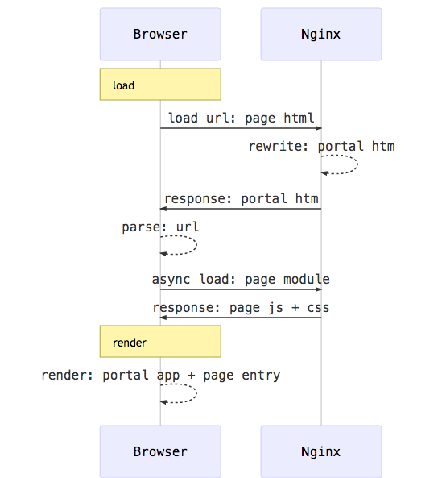

# 1. 概述

***名词定义***

* template： 页面模板 html
* page entry： 产品页面入口
* page html： page entry 结合 template 编译生成的页面html代码
* dll: 第三方库（echarts、vue、element-ui ...）
* zj: 产品公用资源、公用库 common 的代码集合，并作为该集合的代码访问名称前缀
* portal app： 页面类型入口应用
* portal htm：portal app 结合 template 编译生成的 html代码


***开发背景***


按 webpack 的惯用配置，每个页面作为  page entry，并结合 template 生成最终的 page html。

因为 page entry 包含着 zj 等代码。一旦 zj 发生变化，则所有页面都需要重新编译，生成新的 page html。这给产品页面的开发编译、更新部署，增加了很多不必要的负担。


经过一段时间的产品开发迭代，产品的页面类型基本可确认为两类：


- **登录页**：无用户态和菜单，需要做到页面内容的定制
- **功能页**：有用户态和菜单，仅需做到样式上的定制


若把两种页面类型，作为 portal app，维护 zj 代码关联，结合 template 生成 portal htm。而 page entry 仅包含具体的页面逻辑，由 protal app 另行动态载入。 这样就可以切断 page entry 和 zj 的代码硬关联，使得 zj 变化的影响范围，控制在 portal app 内，使维护量做到最小化。


基于上述思路，对前端开发框架做了研发调整，下面将给出具体的说明。


#2. 机制

## 2.1. 页面加载渲染

在不影响原有page html url的访问前提下，则需要结合 Nginx rewrite 机制，玩一个手段。

让原有 page html url 的请求，全部返回对应类型的 protal  htm。

portal htm 所包含的 portal app 代码会通过分析浏览器的location url，动态载入page module对应的资源(js、css)。

待这些资源都加载完毕后，再开始渲染。





**nginx server 配置**

```python
server {
        listen 80;
        # 需要在hosts里配置：     127.0.0.1    live.dev;
        server_name             live.dev;

        location / {
                proxy_set_header Host $host:$server_port;
                proxy_set_header X-Real-IP $remote_addr;
                proxy_set_header REMOTE-HOST $remote_addr;
                proxy_set_header X-Forwarded-For $proxy_add_x_forwarded_for;
                proxy_set_header X-Request-Uri $request_uri;
                proxy_pass http://127.0.0.1:9999;
        }

		# rewrite 处理
        rewrite ^/opms/pages/(.+)\.html$  /opms/portals/admin.htm break;


        location ^~ /opms/ {
              proxy_set_header X-Real-IP $remote_addr;
              proxy_set_header REMOTE-HOST $remote_addr;
              proxy_set_header X-Forwarded-For $proxy_add_x_forwarded_for;
              proxy_pass http://127.0.0.1:9999/opms/;
        }
}

```


## 2.2. 代码组织


目录结构如下：

```
├── build  # 编译结果
├── doc    # 文档
|   ├── deploy #部署流程说明文档
|   └── ... #其他文档    
├── mock   # mock 代码
├── nginx_servers # nginx server 配置样例
├── scripts   # 工具脚本目录
├── webpack_config  # weppack config 目录
│   ├── conf.dev.babel.js
│   ├── conf.dll.babel.js
│   ├── conf.portal.babel.js 
│   └── conf.prod.babel.js
│ 
├── dll    # 第三方库代码
├── portals  # portal app集合目录
│   ├── admin 
│   │   ├── app.vue        # app 组件代码
│   │   ├── index.js       
│   │   └── template.html  # 模板
│   └── login
├── src  # 业务代码所在目录
│   ├── assets  # 产品静态资源
│   ├── i18n    # 产品多语言
│   ├── pages   # 产品页面集合
│   │   └── create
│   │       └── page.vue # page 组件代码
│   └── widgets # 产品组件
└── zj  # 公用资源集合目录
    ├── assets  # 静态
    │   └── menu  # 产品菜单
    ├── common  # 公用代码
    ├── i18n    # 公用多语言
    ├── index.js 
    └── widgets # 公用组件
```


## 2.3. 编译配置

仅罗列关键配置信息进行说明

### 2.3.1. dll webpack config

```javascript
entry: {  # 库入口拆分
    ui: ["jquery","vue", "vue-i18n", "vue-router","element-ui", "element-ui.css", ...],
    net: ["qs", "axios"],
    utils: ["fecha", "lodash", "js-cookie"],
    chart: ["echarts"]
},

plugins: [
	...,
    new webpack.DllPlugin({  # dll 插件配置
        path: "dll/manifest/[name].json",
        name: "dll_[name]"
    })
],

output: {  # 输出为 library
    pathinfo: true,
    path: resolve("./build/dll"),
    filename: "[name].js",
    publicPath: "/opms/dll/",
    library: "dll_[name]",
    libraryTarget: "var"
}
```


### 2.3.2. portal webpack config

```javascript
entry: {  # 入口信息使用脚本扫描 portals目录生成
    "login": ["portals/login/index.js"],
    ...
},


plugins: [
    new webpack.DllReferencePlugin({ # dll 引用
        manifest: resolve(`./dll/manifest/ui.json`),
        name: "dll_ui",
        sourceType: "var"
    }),
    ...
	new HtmlWebpackPlugin({  # 生成 html
        title: "login",
        template: "./portals/login/template.html",
        filename: "portals/login.htm",
        chunks: ["login", "commonChunk", "manifest"],
        hash: true,
        inject: false
    }),
    ... ,
	new HtmlWebpackIncludeAssetsPlugin({  # 引入 dll 资源到 html
            assets: [
                {path: "dll", glob: "**/*.css", globPath: resolve("./build/dll/")},
                ...["dll/ui.js","dll/net.js", ...]
            ], 
            append: false,
            hash: true
        })    
]

output: {
    path: resolve(`./build`),
    filename: "portals/[name].js",
    chunkFilename: "portals/chk-[name].js",
    publicPath: "/opms/"
}
```


### 2.3.3. prodcut webpack config

> 因为product页面需要动态加载，所以输出为AMD形式。

```javascript
entry: { # 入口信息使用脚本扫描 src/pages
    "test/first": ["./src/pages/test/first/page.vue"],
     ....
},

plugins: [
	new webpack.ProvidePlugin({
        _: "lodash",
        $: "jquery",
        zj: "zj",
    })
],

resolve: {
    alias: {  
    	"src": resolve(`./src/`),
    }
},

externals: { # 下列库，定义为外部引用，切断代码硬关联
    vue: "vue2",
    zj: "zj",
    jquery: "jquery",
    lodash: "lodash",
    qs: "qs",
    axios: "axios",
    fecha: "fecha",
    "vue-router": "vue-router",
    echarts: "echarts"
},

output: { # 按amd方式生成结果
    path: resolve(`./build`),
    filename: `setting/[name].js`,
    chunkFilename: `setting/chk-[name].js`,
    publicPath: `/opms/`,
    library: `setting/[name]`,
    libraryTarget: "amd"      
}
```


### 2.3.4. dev webpack config

为了覆盖 portal 和 product，配置文件定义为数组，包含两者

```js
import portalConf from "./conf.portal.babel"
import prodConf from "./conf.prod.babel"

module.exports = [
    portalConf,
    prodConf
]
```


# 3. 使用

## 3.0. 开发环境准备

### 3.0.1. 安装

* nginx >= 8.4.0
* yarn >= 0.18.1

### 3.0.2. 克隆代码

**克隆代码**

```
git@code.badam.mobi:zhijian-server/zj_opms_h5pc.git
```


## 3.1. dll 预编译

因为portal需要依赖编译好的dll库，所以，首次克隆或dll发生变更时，都需要做一次dll编译。

```
yarn dll -- -p

参数说明：
-- 末尾追加指令
-p 按生产模式编译
```


## 3.2. 开发调试

本地开发，结合webpack的热模块替换(HMR)机制，可覆盖portals 和 product两部分。

```
yarn dev
```

因为nginx 做了简单的映射 ，所以可以通过下述链接访问产品对应页面

http://dev.zj.test/opms/pages/create.html

dev.zj.test 下，所有 api 请求都会访问 mock，若需联合测试服务器后端api进行联调，则需配置好相应的nginx server即可（可参考 nginx_servers 样例）

http://t7.zj.test/opms/pages/create.html

> 需要注意的是，为了方便，nginx server 配置 做了 404 fallback 处理。 即请求的url在本地找不到对应的文件，则会尝试返回测试服务器上的文件。 所以要留心测试服务器上旧代码造成的影响！


### 3.2.1. 模板生成


**Mock生成**

```
yarn mock-gen -- uc/common/user_info

此处将生成mock api
/mock/uc/common/user_info.js
```


## 3.3. 测试服务器推送

前端代码，包含 dll、portal、product page 三大块。为方便起见，dll的代码推送，也纳入portal一并推送。


### 3.3.1. portal 推送（全部）

```
yarn portal-sync -- chashu@7

参数说明：
chashu: 用户名
7: 测试服务器序号
```


### 3.3.2. 业务代码推送

```
yarn prod-sync -- chashu@7
```


## 3.4. 部署

为了规避部署过程中的疏漏，每次部署需要严格按照部署文档的步骤执行，[具体查看](doc/deploy.md)。

### 3.4.0. 首次克隆 zj_front_deploy

在项目的上级目录下，进行克隆

```
地址 ：git clone git@code.badam.mobi:zhijian-server/zj_front_deploy.git
```

### 3.4.1. 部署 portal


```
BRANCH=opms yarn portal-deploy

注意：此命令会把zj_front_deploy切换至opms处理！

cd ../zj_front_deploy
git add .
git commit -m "部署处理说明"
git push origin opms
```


### 3.4.2. 部署业务代码


```
BRANCH=opms yarn prod-deploy
```


